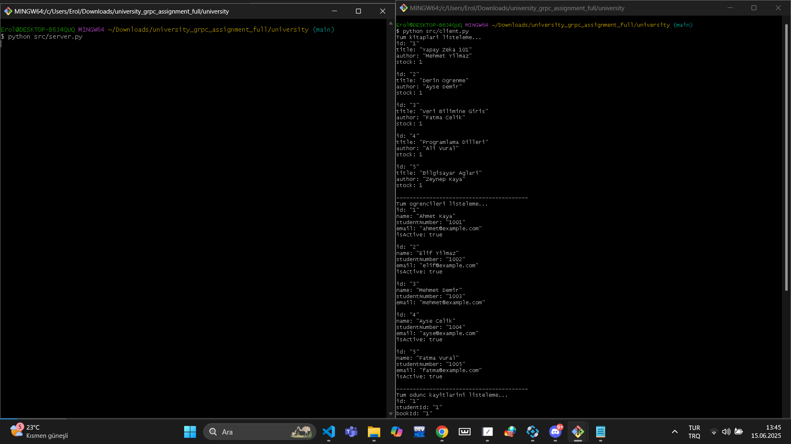
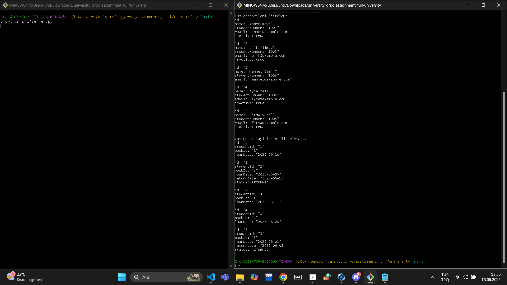

# grpcurl Test Dokümantasyonu

## Kitap Listeleme
```bash
grpcurl -plaintext localhost:50051 university.BookService/ListBooks
```

## Öğrenci Listeleme
```bash
grpcurl -plaintext localhost:50051 university.StudentService/ListStudents
```

## Ödünç Listeleme
```bash
grpcurl -plaintext localhost:50051 university.LoanService/ListLoans
```

## Yanıt Örnekleri



